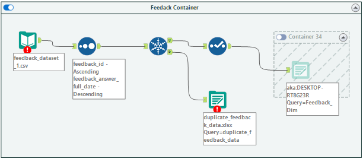
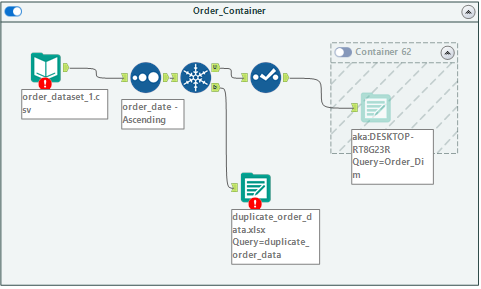
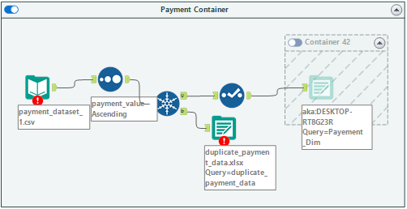
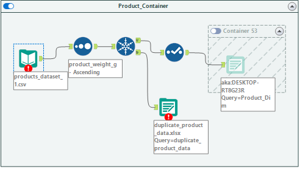
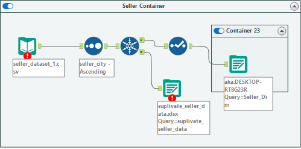
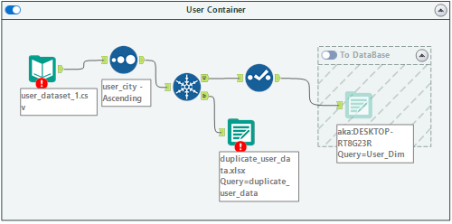
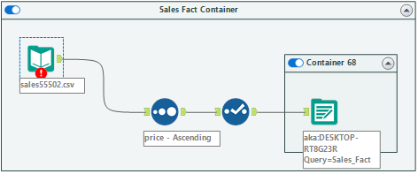
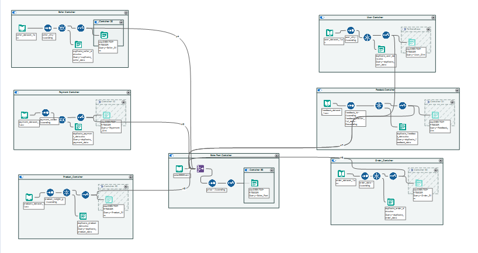

# Staging Layer README

## Overview

The Staging Layer is a critical step in the data engineering process, where raw data from CSV files is ingested into a SQL Server database using Alteryx. This layer serves as an intermediate step, facilitating minimal transformations and ensuring data integrity before it progresses to the Data Warehouse.

## Schema Design


### Feedback Table

```sql
-- Feedback Table Schema
CREATE TABLE [dbo].[Feedback_Dim](
	[feedback_id] [varchar](254) NOT NULL,
	[feedback_score] [bigint] NULL,
	[feedback_sent_date] [datetime] NULL,
	[feedback_answer_date] [datetime] NULL,
	[Days_Between] [int] NULL,
 CONSTRAINT [PK_Feedback_Dim] PRIMARY KEY CLUSTERED 
(
	[feedback_id] ASC
)WITH (PAD_INDEX = OFF, STATISTICS_NORECOMPUTE = OFF, IGNORE_DUP_KEY = OFF, ALLOW_ROW_LOCKS = ON, ALLOW_PAGE_LOCKS = ON, OPTIMIZE_FOR_SEQUENTIAL_KEY = OFF) ON [PRIMARY]
) ON [PRIMARY]
GO
```


The "Feedback" table captures feedback details with minimal transformation, preserving primary keys.

### Order Track Table

```sql
-- Order Track Table Schema
CREATE TABLE [dbo].[Order_Dim](
	[order_id] [varchar](254) NOT NULL,
	[order_status] [varchar](254) NULL,
	[order_date] [datetime] NULL,
	[order_approved_date] [datetime] NULL,
	[pickup_date] [datetime] NULL,
	[delivered_date] [datetime] NULL,
	[estimated_time_delivery] [datetime] NULL,
 CONSTRAINT [PK_Order_Dim] PRIMARY KEY CLUSTERED 
(
	[order_id] ASC
)WITH (PAD_INDEX = OFF, STATISTICS_NORECOMPUTE = OFF, IGNORE_DUP_KEY = OFF, ALLOW_ROW_LOCKS = ON, ALLOW_PAGE_LOCKS = ON, OPTIMIZE_FOR_SEQUENTIAL_KEY = OFF) ON [PRIMARY]
) ON [PRIMARY]
GO
```

The "Order Track" table maintains order details, including status and timestamps.


### Payment Table

```sql
-- Payment Table Schema
CREATE TABLE [dbo].[Payement_Dim](
	[payment_id] [bigint] NOT NULL,
	[payment_sequential] [bigint] NULL,
	[payment_type] [varchar](254) NULL,
	[payment_installments] [bigint] NULL,
	[payment_value] [real] NULL,
 CONSTRAINT [PK_Payement_Dim] PRIMARY KEY CLUSTERED 
(
	[payment_id] ASC
)WITH (PAD_INDEX = OFF, STATISTICS_NORECOMPUTE = OFF, IGNORE_DUP_KEY = OFF, ALLOW_ROW_LOCKS = ON, ALLOW_PAGE_LOCKS = ON, OPTIMIZE_FOR_SEQUENTIAL_KEY = OFF) ON [PRIMARY]
) ON [PRIMARY]
GO
```

The "Payment" table records payment details with minimal transformation, ensuring data consistency.



### Product Table

```sql
-- Product Table Schema
CREATE TABLE [dbo].[Product_Dim](
	[product_id] [varchar](254) NOT NULL,
	[product_category] [varchar](254) NULL,
	[product_name_lenght] [real] NULL,
	[product_description_lenght] [real] NULL,
	[product_photos_qty] [real] NULL,
	[product_weight_g] [real] NULL,
	[product_length_cm] [real] NULL,
	[product_height_cm] [real] NULL,
	[product_width_cm] [real] NULL,
 CONSTRAINT [PK_Product_Dim] PRIMARY KEY CLUSTERED 
(
	[product_id] ASC
)WITH (PAD_INDEX = OFF, STATISTICS_NORECOMPUTE = OFF, IGNORE_DUP_KEY = OFF, ALLOW_ROW_LOCKS = ON, ALLOW_PAGE_LOCKS = ON, OPTIMIZE_FOR_SEQUENTIAL_KEY = OFF) ON [PRIMARY]
) ON [PRIMARY]
GO
```

The "Product" table holds product information, maintaining the integrity of primary keys.



### Seller Table

```sql
-- Seller Table Schema
CREATE TABLE [dbo].[Seller_Dim](
	[seller_id] [varchar](254) NOT NULL,
	[seller_zip_code] [bigint] NULL,
	[seller_city] [varchar](254) NULL,
	[seller_state] [varchar](254) NULL,
 CONSTRAINT [PK_Seller_Dim] PRIMARY KEY CLUSTERED 
(
	[seller_id] ASC
)WITH (PAD_INDEX = OFF, STATISTICS_NORECOMPUTE = OFF, IGNORE_DUP_KEY = OFF, ALLOW_ROW_LOCKS = ON, ALLOW_PAGE_LOCKS = ON, OPTIMIZE_FOR_SEQUENTIAL_KEY = OFF) ON [PRIMARY]
) ON [PRIMARY]
GO
```

The "Seller" table captures seller details with minimal transformation.



### User Data Table

```sql
-- User Data Table Schema
CREATE TABLE [dbo].[User_Dim](
	[user_id] [varchar](254) NOT NULL,
	[user_zip_code] [bigint] NULL,
	[user_city] [varchar](254) NULL,
	[user_state] [varchar](254) NULL,
 CONSTRAINT [PK_User_Dim] PRIMARY KEY CLUSTERED 
(
	[user_id] ASC
)WITH (PAD_INDEX = OFF, STATISTICS_NORECOMPUTE = OFF, IGNORE_DUP_KEY = OFF, ALLOW_ROW_LOCKS = ON, ALLOW_PAGE_LOCKS = ON, OPTIMIZE_FOR_SEQUENTIAL_KEY = OFF) ON [PRIMARY]
) ON [PRIMARY]
GO
```

The "User Data" table holds user information, and the data is truncated for a clean slate before ingestion.


### Sales Table

```sql
-- Sales Table Schema
CREATE TABLE [dbo].[Sales_Fact](
	[order_id] [varchar](254) NULL,
	[user_id] [varchar](254) NULL,
	[product_id] [varchar](254) NULL,
	[feedback_id] [varchar](254) NULL,
	[seller_id] [varchar](254) NULL,
	[pickup_limit_date] [datetime] NULL,
	[price] [real] NULL,
	[shipping_cost] [real] NULL,
	[payment_id] [bigint] NULL
) ON [PRIMARY]
GO

ALTER TABLE [dbo].[Sales_Fact]  WITH CHECK ADD  CONSTRAINT [FK_Sales_Fact_Feedback_Dim] FOREIGN KEY([feedback_id])
REFERENCES [dbo].[Feedback_Dim] ([feedback_id])
GO

ALTER TABLE [dbo].[Sales_Fact] CHECK CONSTRAINT [FK_Sales_Fact_Feedback_Dim]
GO

ALTER TABLE [dbo].[Sales_Fact]  WITH CHECK ADD  CONSTRAINT [FK_Sales_Fact_Order_Dim] FOREIGN KEY([order_id])
REFERENCES [dbo].[Order_Dim] ([order_id])
GO

ALTER TABLE [dbo].[Sales_Fact] CHECK CONSTRAINT [FK_Sales_Fact_Order_Dim]
GO

ALTER TABLE [dbo].[Sales_Fact]  WITH CHECK ADD  CONSTRAINT [FK_Sales_Fact_Payement_Dim] FOREIGN KEY([payment_id])
REFERENCES [dbo].[Payement_Dim] ([payment_id])
GO

ALTER TABLE [dbo].[Sales_Fact] CHECK CONSTRAINT [FK_Sales_Fact_Payement_Dim]
GO

ALTER TABLE [dbo].[Sales_Fact]  WITH CHECK ADD  CONSTRAINT [FK_Sales_Fact_Product_Dim] FOREIGN KEY([product_id])
REFERENCES [dbo].[Product_Dim] ([product_id])
GO

ALTER TABLE [dbo].[Sales_Fact] CHECK CONSTRAINT [FK_Sales_Fact_Product_Dim]
GO

ALTER TABLE [dbo].[Sales_Fact]  WITH CHECK ADD  CONSTRAINT [FK_Sales_Fact_Seller_Dim] FOREIGN KEY([seller_id])
REFERENCES [dbo].[Seller_Dim] ([seller_id])
GO

ALTER TABLE [dbo].[Sales_Fact] CHECK CONSTRAINT [FK_Sales_Fact_Seller_Dim]
GO

ALTER TABLE [dbo].[Sales_Fact]  WITH CHECK ADD  CONSTRAINT [FK_Sales_Fact_User_Dim] FOREIGN KEY([user_id])
REFERENCES [dbo].[User_Dim] ([user_id])
GO

ALTER TABLE [dbo].[Sales_Fact] CHECK CONSTRAINT [FK_Sales_Fact_User_Dim]
GO
```

The "Sales" table consolidates data from various sources, linking to relevant tables through foreign keys.



## Alteryx Workflow

For each source table, an Alteryx workflow is created to facilitate the movement of data into the Staging Layer. The workflow ensures data consistency and integrity during the extraction and loading process.




