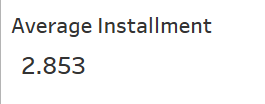

# Final insights from the analysis
## Overview

In the culmination of this data engineering project, we present insightful visualizations derived from Power BI, offering a comprehensive overview of key metrics and patterns within the e-commerce dataset.

# Page one

### Key Metrics

- **Total Orders:**
  - Distinct number of orders: 99.44 K

- **Average Installments:**
  - AVERAGEX function calculates the average number of installments, yielding 2.853 on average.
  

- **Total Payments:**
  - Calculated by counting the distinct payment IDs, providing a holistic view of payment transactions.

### Payment Distribution

- **Credit Card:**
  - Total order: 76795

- **Bilpay:**
  - Total order: 19784
- **Voucher:**
  - Total order: 5775
- **Debit Card:**
  - Total order: 1529
  
  

### Best Selling Based on Category 

- **bed_bath_table_category:**
    - shipping_cost : 204,693,040
- **health_beauty_category:**
    - average_shipping_cost : 182,566,730
- *furniture_decor_category:**
    - average_shipping_cost : 172,749,300
      
    
### Total Order By year and Quarters

- **2016 :**
  - Best Quarter : Q4
    - Best Month : October
        - Total orders : 324

- **2017 :**
  - Best Quarter : Q4
    - Best Month : November
        - Total orders : 7544

- **2018 :**
  - Best Quarter : Q1
    - Best Month : October
        - Total orders : 7269

      

### Total Orders By User State
- **Best States :**
  - BANTEN >> Total Orders = 20,399
  - JAWA BARAT >> Total Orders = 12,570
  - DKI JAKARTA >> Total orders = 12,228
  
      

### Total Orders By Seller State
- **Best States :**
  - BANTEN >> Total Orders = 29,965
  - JAWA BARAT >> Total Orders = 9798
  - JAWA TENGAH >> Total orders = 9224
  
      

### Number Of Orders Based On User Location 

## Conclusion

This Tableau dashboard provides a visually engaging representation of key e-commerce metrics, enabling stakeholders to make informed decisions. The insights gained from this analysis encompass order distribution, payment trends, and correlations, offering a holistic understanding of the dataset's dynamics. The weak negative correlation between feedback score and delivery delay suggests an area for improvement in customer satisfaction. As the e-commerce industry continues to evolve, these insights will contribute to strategic decision-making and process optimization.
