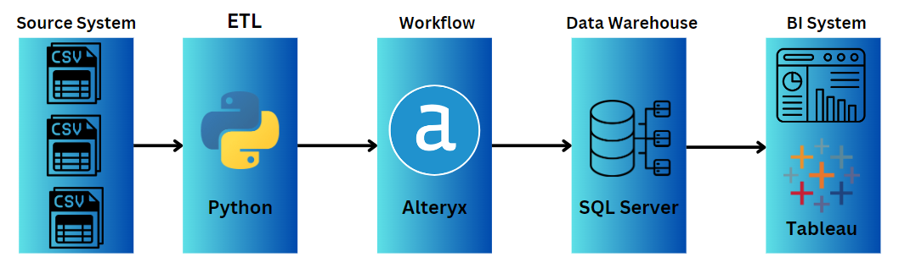
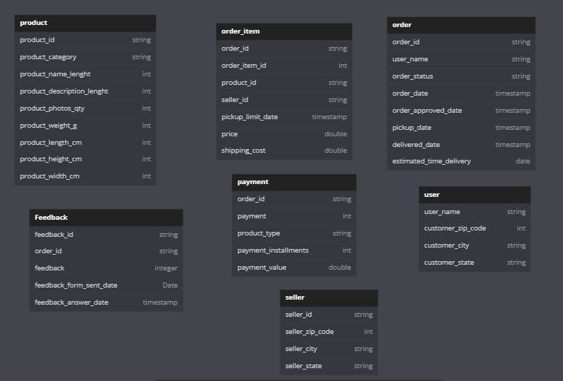
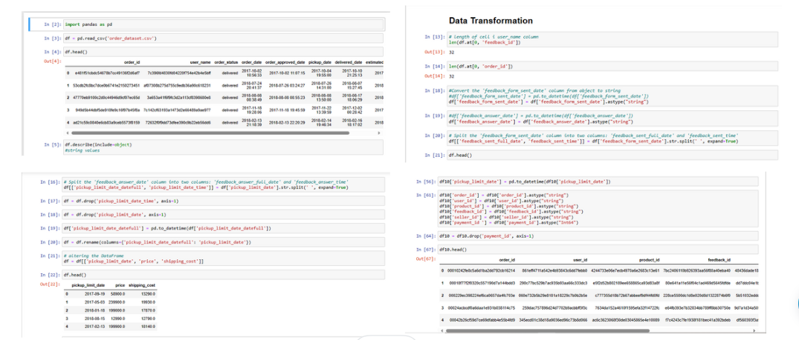
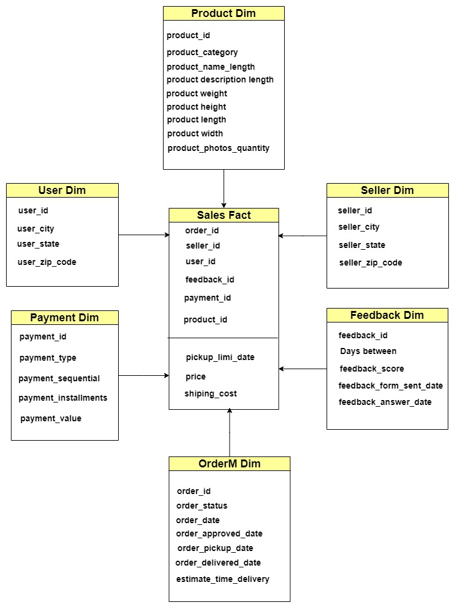

# Data-Engineering-project-for-E-Commerce
## Project Description
Welcome to comprehensive end-to-end data engineering project tailored for e-commerce. In this project, We have meticulously crafted a streamlined data pipeline to handle diverse datasets from various sources. The journey involves extracting data from CSV files, utilizing Python for minimal transformations, transferring it to SQL Server for staging, and further refining it with Alteryx transformations. Finally, we delve into SQL Server for data modeling and leverage Tableau for insightful analysis.
## Data architecture

## Key Components:

#### Python Transformations:
Witness the power of Python as it refines and transforms data within the SQL Server staging area, ensuring data quality and integrity before proceeding to the modeling phase.

#### Workflow with Alteryx:
Explore the Alteryx workflow that efficiently extracts data from CSV files and loads it into SQL Server with minimal transformations, ensuring a smooth transition from source to the staging area.

#### Data Modeling in SQL Server:
Delve into the intricacies of data modeling, where the structure of the data warehouse, including dimension and fact tables, is meticulously crafted for analytical purposes.

#### SQL Analysis for Strategic Insights:
Experience the synergy of SQL Server and Tableau as We leverage queries to uncover valuable insights, enabling informed decision-making in the dynamic e-commerce landscape.

### Project Highlights:

- **Efficient ETL Process:** Alteryx facilitates a seamless transition from CSV to SQL Server, ensuring data integrity with minimal transformations.

- **Robust Python Transformations:** Python enhances data quality during the staging process, preparing it for comprehensive analysis.

- **Scalable Data Modeling:** The architecture is designed to handle growing datasets and evolving business requirements during the modeling phase.

- **Actionable Intelligence:** The analysis phase, powered by SQL Server and visualized through Tableau, provides strategic insights to drive informed business decisions.

## [1. Source Data](https://github.com/ElSayed-Fathi/Data-Engineering-project-for-E-Commerce/blob/39ad69d2d37099fa41b76d7e503a428064980460/1%20Data%20Sources/README%20(2).md)

## Data Source:

## [2. ETL Using Python](https://github.com/ElSayed-Fathi/Data-Engineering-project-for-E-Commerce/tree/0ebbe62252ef0016922c4cb9b87696cd8b87dff1/1%20Data%20Sources)

### ETL Using Python:

## [3. Alteryx Workflow ](https://github.com/ElSayed-Fathi/Data-Engineering-project-for-E-Commerce/tree/b23186f3ff775672d3c36ae8d8ae24422dd205e0/2%20Staging%20Layer)

###  Alteryx Workflow :

## [4. Data Warehouse Model ](https://github.com/ElSayed-Fathi/Data-Engineering-project-for-E-Commerce/tree/cc7b833140ddde630aa206cfcacba4e7d713dc18/5%20Data%20Warehouse%20Dimensional%20Model%20and%20Code)

###  Data Warehouse Model :

